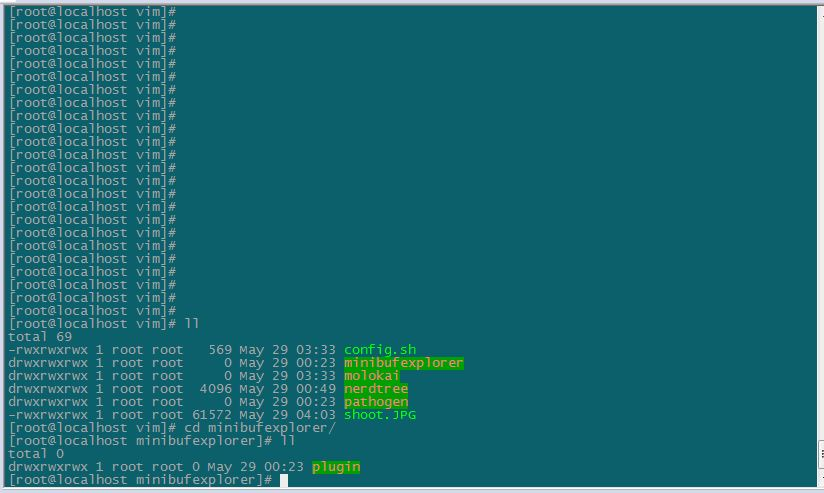

# config
some software config， donot repeat yourself

* securtcrt
Opitions--Global Opitions-General-Configuration Folder
解压到这个config目录

效果:  
  


* vim
``` c++
git clone git@github.com:zzqboy/config.git
cd config/vim
./config.sh
```

效果:  
  
