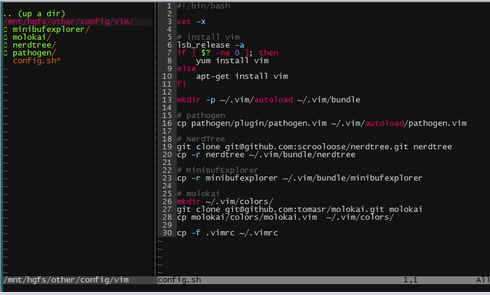

vim config， donot repeat yourself

# vim
```sh
git clone git@github.com:zzqboy/config.git
cd config/vim
./config.sh
```
## minibuffexplorer
打开多个文件时自动出现上方，使用`:b+n`来打开

## nerdtree
`<C-n>`打开目录树，o打开文件，`<C-w>`切换窗口

效果:  
  
